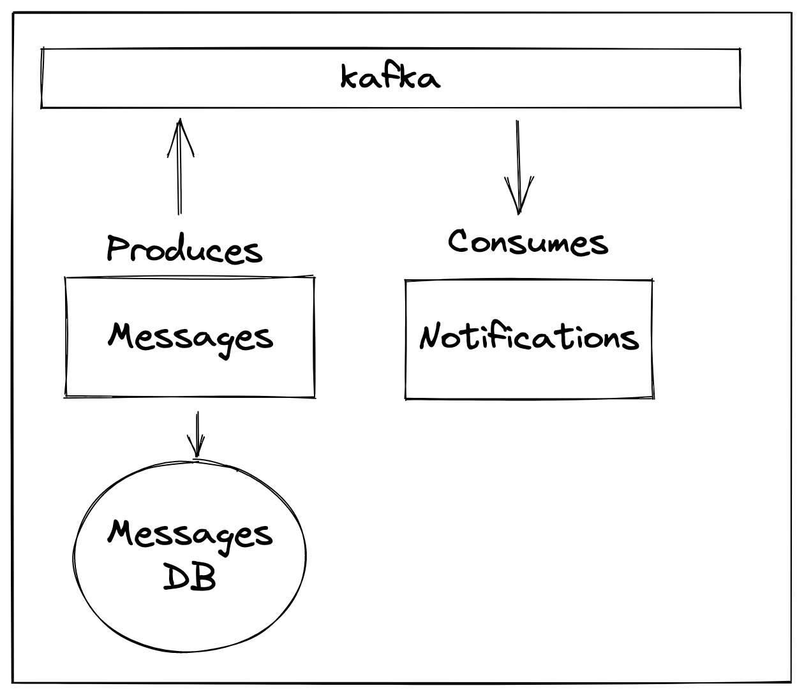

# Building event-driven systems with kafka

## What are we building?
* A simple event-driven system that will allow us to send messages to kafka and then consume them

## Housekeeping
### You will need
1. Docker
2. Node.js
### Starting Kafka & Conductor
Follow the instructions in the conduktor folder

## Install dependencies
`yarn add kafkajs`

## What will you learn?
* Setup a Kafka cluster for local development with Docker
* Connect a producer to the cluster
* Connect a consumer to the cluster
* Graceful shutdown - disconnect the producer and consumer from the cluster
* Using Conduktor to view & manage the cluster

## Why Kafka?
* Kafka is a distributed streaming platform
* It is horizontally scalable
* It is fault tolerant
* It is fast
* It is used by many companies including Uber, Netflix, LinkedIn, and many more

## Kafka terms and definitions
* **Producer** - A producer is a client that sends messages to a topic on the Kafka cluster

* **Consumer** - A consumer is a client that reads messages from a topic on the Kafka cluster

* **Topic** - A topic is a category or feed name to which records are published. Topics in Kafka are always multi-subscriber

* **Broker** - A broker is a server that hosts a topic. Each broker is identified by a unique id

* **Partition** - A partition is an ordered, immutable sequence of records that is continually appended to a file. The records in the partitions are each assigned a sequential id number called the offset that uniquely identifies each record within the partition.

* **Replication** - Replication is the process of duplicating data across multiple brokers. Replication provides fault tolerance and high availability. A topic can have multiple partitions, and each partition can have multiple replicas.

* **Consumer Group** - A consumer group is a group of consumers that cooperate to consume messages from a set of topics. Each consumer in a group can process the messages in parallel. The Kafka cluster ensures that each message is delivered to one consumer in each subscribing consumer group.

* **Offset** - The offset is a unique identifier for a message within a partition. The offset is assigned when a producer publishes a message to a partition. The offset is used by the consumer to determine the message to process next.

* **Leader** - The leader is the server that is currently the active controller for a partition. The leader handles all read and write requests for the partition. Only the leader can become a follower.

* **Follower** - The follower is a passive server that replicates the log of the leader. The follower can become the leader if the current leader fails.
